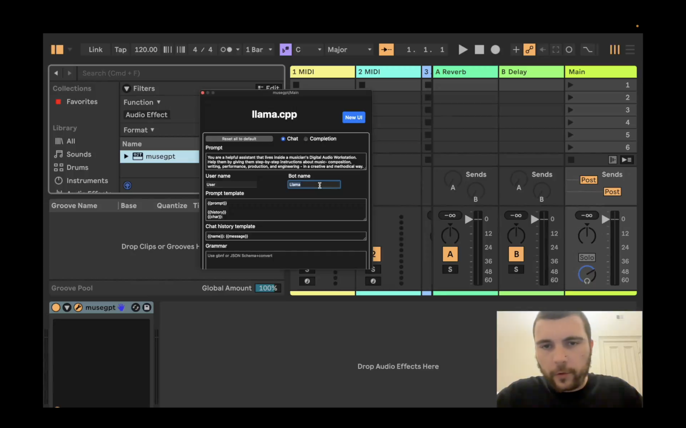

# musegpt

[](https://github.com/greynewell/musegpt/actions/workflows/cmake.yml) [](https://www.gnu.org/licenses/agpl-3.0) [](#supported-platforms) [](https://isocpp.org/) [](https://juce.com/) [](https://github.com/ggerganov/llama.cpp/commit/feff4aa8461da7c432d144c11da4802e41fef3cf)

Run local Large Language Models (LLMs) in your Digital Audio Workstation (DAW) to create music.

## Table of Contents

- [Architecture](#architecture)
- [Features](#features)
- [Demo](#demo)
- [Installation](#installation)
- [Getting Started](#getting-started)
- [Requirements](#requirements)
- [Usage](#usage)
- [Supported Platforms](#supported-platforms)
- [Contributing](#contributing)
- [License](#license)
- [Acknowledgments](#acknowledgments)

## Architecture


For more information, see [Technical Approach](https://musegpt.org/technical_approach.html).

## Features

Currently supported features include:

- ✅ LLM chat
- ✅ VST3 plugin
- ✅ MIDI input
- ✅ Audio input

For more information about plans for upcoming features, check out the [Roadmap on GitHub Projects](https://github.com/users/greynewell/projects/1)!

## Demo

[](https://x.com/greynewell/status/1834805775686156534)

*Click the image above to watch a demo of musegpt in action.*

## Installation

To install `musegpt`, you can download the latest binaries from [Releases](https://github.com/greynewell/musegpt/releases).

If you want to build from source, follow these steps:

1. **Clone the repository:**

   ```bash
   git clone --recurse-submodules -j2 https://github.com/greynewell/musegpt.git
   cd musegpt
   ```

2. **Install dependencies:**

   Ensure you have the required dependencies installed. See [Requirements](#requirements) for details.

3. **Build the project:**

     Run the shell build script:

     ```bash
     ./scripts/build/debug.sh
     ```

     or

     ```bash
     ./scripts/build/release.sh
     ```

4. **Install the plugin:**

   CMake will automatically copy the built VST3, AU, or AAX plugin to your DAW's plugin directory.

   - **macOS:** `~/Library/Audio/Plug-Ins/VST3/`
   - **Linux:** `~/.vst3/`

## Getting Started

After installing musegpt, open your DAW and rescan for new plugins. Load `musegpt` as a plugin and start interacting with the LLM to enhance your music creation process!

## System Prompt

Feel free to experiment with the system prompt to customize the behavior of the LLM. Here's a suggestion to get you started:

> You are a helpful assistant that lives inside a musician's Digital Audio Workstation. Help them by giving them step-by-step instructions about music—composition, writing, performance, production, and engineering—in a creative and methodical way.

## Requirements

- **Operating System:**
  - macOS 10.11 or later
  - Linux (mainstream distributions)
- **DAW Support:** Any DAW that supports VST3 plugins (Ableton Live, FL Studio, Logic Pro, Pro Tools, etc.)
- **Dependencies:**
  - [JUCE](https://juce.com/) (Audio application framework)
  - [llama.cpp](https://github.com/ggerganov/llama.cpp) (LLM inference library)
  - C++17 compatible compiler (e.g., GCC 7+, Clang 5+, MSVC 2017+)
  - [CMake](https://cmake.org/) 3.15 or later

## Usage

1. **Load the Plugin:**

   In your DAW, add musegpt as a VST3 plugin on a track.

2. **Interact with the LLM:**

   Use the plugin's interface to chat with the integrated LLM. You can input MIDI or audio data for analysis (features under development).

3. **Create Music:**

   Leverage the power of AI to inspire new musical ideas, assist with composition, or generate creative suggestions.

## Supported Platforms

musegpt is cross-platform and supports the following operating systems:

- **macOS:** macOS 10.11 or later
- **Linux:** Mainstream distributions

## Supported Models

musegpt currently supports the following models:

- **gemma-2b-it.fp16.gguf**

Any model compatible with `llama.cpp` should work with `musegpt`. Feel free to experiment with different models to find the best one for your needs—and raise a pull request!

## Contributing

We welcome contributions from the community!

- **Bug Reports & Feature Requests:** Use the [issue tracker](https://github.com/greynewell/musegpt/issues) to report bugs or suggest new features.
- **Pull Requests:** Feel free to submit pull requests to fix issues or implement new features.
- **Guidelines:** Please read our [Contributing Guidelines](CONTRIBUTING.md) before contributing.

## License

This project is licensed under the [AGPL v3](LICENSE).

## Acknowledgments

- **[JUCE](https://juce.com/):** For the powerful audio application framework.
- **[llama.cpp](https://github.com/ggerganov/llama.cpp):** For enabling efficient LLM inference.
- **Community Contributors:** Thanks to everyone who has contributed to open-source projects that make `musegpt` possible.

## Community

Join our community on Discord! [GreyArea.ai](http://greyarea.ai)

---

*Note: This project is under active development. Stay tuned for updates on MIDI and audio analysis and generation features!*
