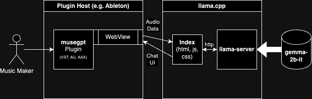

# [musegpt](https://github.com/greynewell/musegpt) 

     

Run local Large Language Models (LLMs) in your Digital Audio Workstation (DAW) to provide inspiration, instructions, and analysis for your music creation.

## Table of Contents

- [Features](#features)
- [Demo](#demo)
- [Requirements](#requirements)
- [Installation](#installation)
- [Usage](#usage)
- [Architecture](#architecture)
- [Contributing](#contributing)
- [License](#license)
- [Acknowledgments](#acknowledgments)

## Features

Currently supported features include:

- ✅ LLM chat
- ✅ VST3 plugin
- ✅ MIDI input
- ✅ Audio input

For more information about plans for upcoming features, check out the [Roadmap on GitHub Projects](https://github.com/users/greynewell/projects/1)!

## Demo

*Click the image above to watch a demo of musegpt in action.*

## Requirements

You'll need a C++17 compatible compiler, CMake, and Python 3.10 or later. See [Requirements](https://musegpt.org/requirements.html) for more details on supported Operating Systems, models, DAWs, and more.

## Installation

To install `musegpt`, you can download the latest binaries from [Releases](https://github.com/greynewell/musegpt/releases).

If you want to build from source, follow the [Installation](https://musegpt.org/installation.html) instructions.

## Usage

Please refer to the [Usage](https://musegpt.org/usage.html) section of the documentation.

## Architecture

For more information, see [Technical Approach](https://musegpt.org/technical_approach.html).

## Contributing

We welcome contributions from the community!

- **Bug Reports & Feature Requests:** Use the [issue tracker](https://github.com/greynewell/musegpt/issues) to report bugs or suggest new features.
- **Pull Requests:** Feel free to submit pull requests to fix issues or implement new features.
- **Guidelines:** Please read our [Contributing Guidelines](CONTRIBUTING.md) before contributing.

## License

This project is licensed under the [AGPL v3](LICENSE).

## Acknowledgments

- **[JUCE](https://juce.com/):** For the powerful audio application framework.
- **[llama.cpp](https://github.com/ggerganov/llama.cpp):** For enabling efficient LLM inference.
- **Community Contributors:** Thanks to everyone who has contributed to open-source projects that make `musegpt` possible.

## Community

Join our community on Discord! [GreyArea.ai](http://greyarea.ai)

---

*Note: This project is under active development. Stay tuned for updates on MIDI and audio analysis and generation features!*
