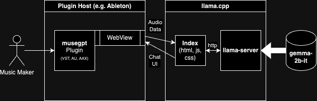

# Technical Approach

## Selecting an Audio Programming Language

C++ was chosen for its:

- Real-time audio processing capabilities with mature libraries.
- Compatibility with major audio creation software and APIs.
- Support for real-time online inference in a local-only environment.

## Building a Cross-Platform Audio Plugin

- **Plugin Format:** VST3 for cross-platform support.
- **Framework:** Utilized **JUCE** for its audio processing capabilities and plugin format support.

## Audio Processing and Analysis Library

**JUCE** was selected for:

- Audio processing capabilities.
- GUI development tools.
- Support for multiple plugin formats (VST, AU, AAX, etc.).
- MIDI handling.

## Building a Local-First Inference Engine

- Integrated **llama.cpp** for efficient local LLM inference.
- Implemented a background process for running **llama.cpp**, with a WebView interface inside the JUCE plugin.

## Integration

- Utilized CMake for building and packaging the plugin.
- The architecture allows low-latency inference calls and communication between the plugin and the LLM.

---

*[Back to Home](index.md)*